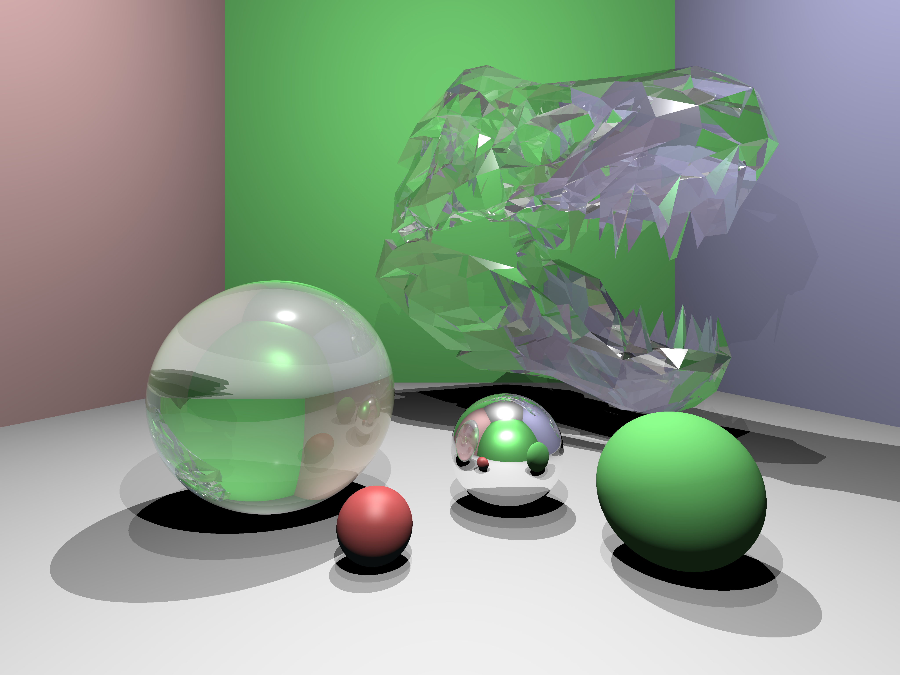

# Computer Graphics Cup

### Authors:

Valsecchi Michelangelo and Michele Cattaneo

### Task:

Make a raytracer capable of rendering triangle meshes by implementing ray-triangle intersection, kd-tree, and simple mesh reader.

### Result Example: 

### How to run:

The raytracer can be run manually by first compiling the code with `c++ -std=c++17 -O3 main.cpp -o main` followed by `./main && open result.ppm` to run the program and visualise the result. Note the requirement of using c++17 which comes from the threadpool used to parallelise the program. The flag `-O3` tells the compiler to use optimizations that allow a faster execution.

Alternatively one can run the program using `cmake`: TODO